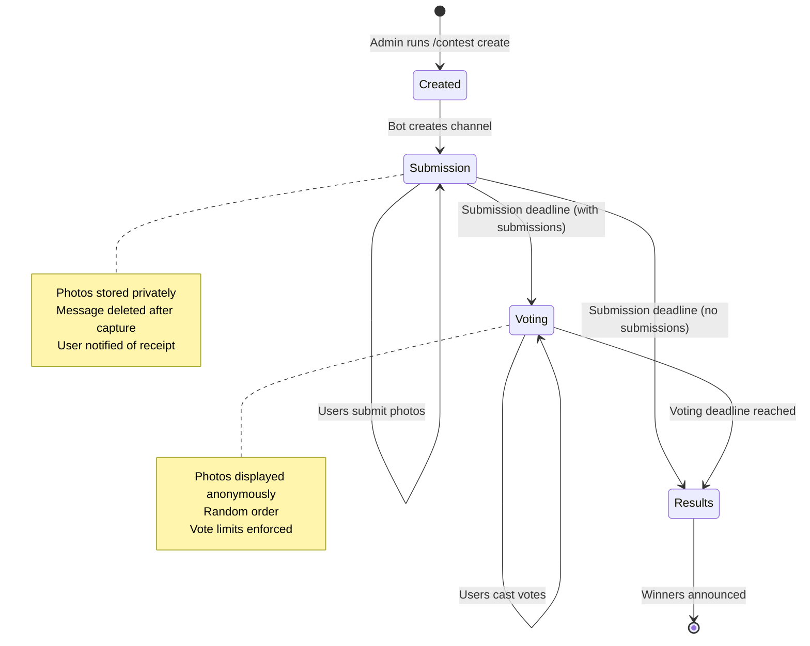
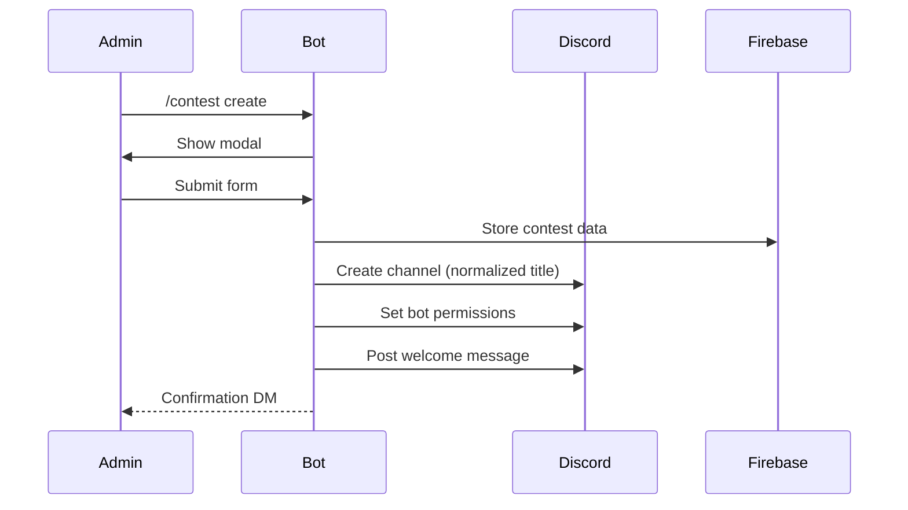
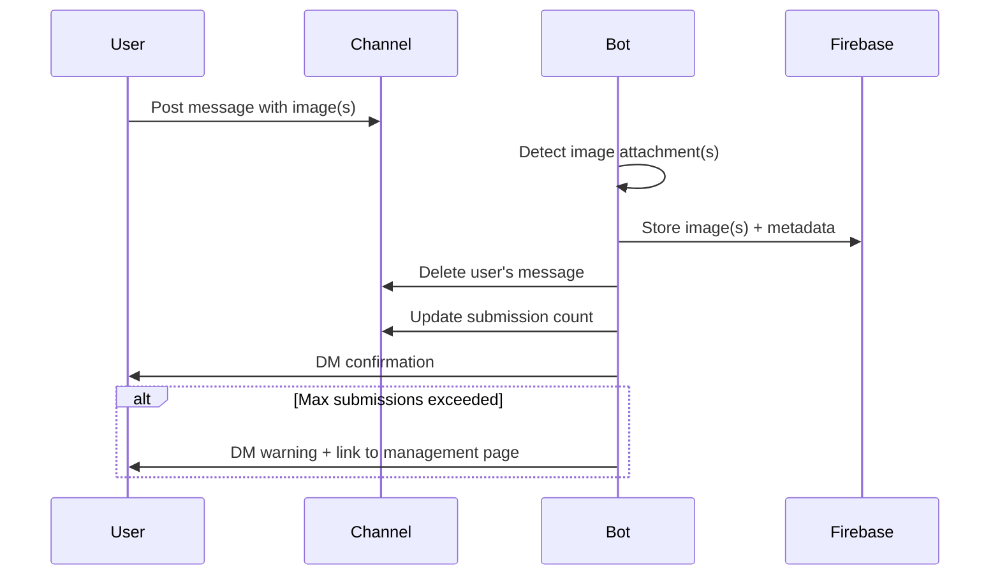
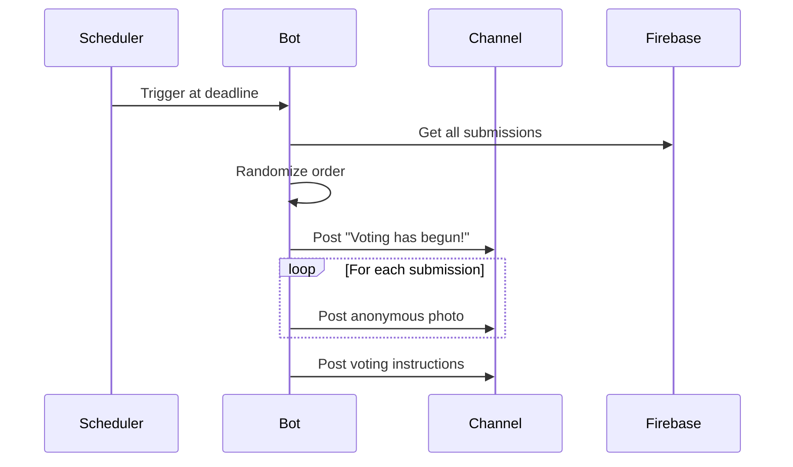
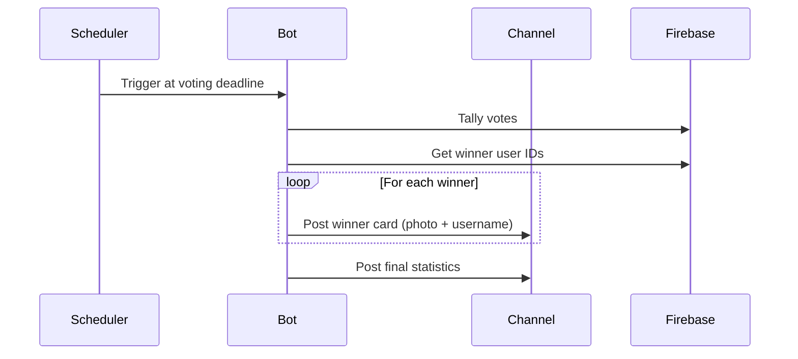
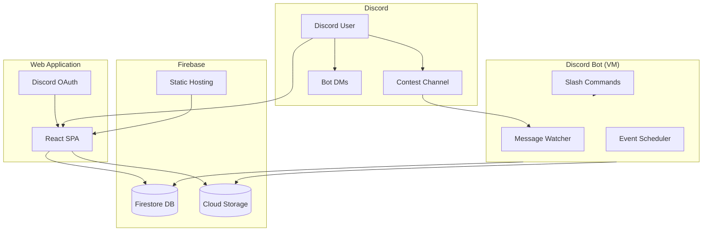
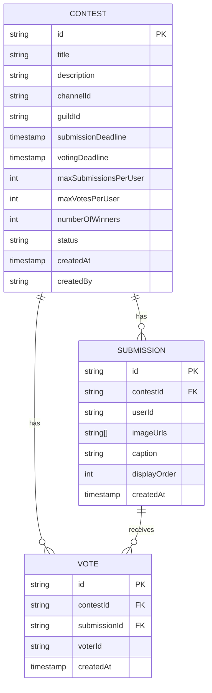

# USS Enterprise Photo Contest Bot - Product Requirements Document

## Executive Summary

The USS Enterprise Photo Contest Bot is a Discord bot paired with a lightweight web application that enables communities to run photo contests. The system manages the complete contest lifecycle: creation, submissions, anonymous voting, and winner announcements. It's designed to work within Firebase's free tier constraints while providing a seamless user experience across Discord and web interfaces.

## Problem Statement

Running photo contests on Discord currently requires manual coordination:
- Contest organizers must manually track submissions
- There's no built-in way to anonymize photos during voting
- Counting votes is tedious and error-prone
- Users have no way to manage their submissions after posting
- There's no permanent record of past contests and winners

This bot solves these problems by automating the entire contest workflow.

## User Personas

### Contest Organizer (Admin)
- Server moderator or admin who wants to run photo contests
- Needs simple setup with configurable parameters
- Wants hands-off operation once contest is created
- May run multiple contests over time

### Contest Participant
- Server member who wants to submit photos
- May not be tech-savvy
- Wants clear instructions and feedback
- Needs to manage submissions (view, delete, modify)

### Contest Voter
- Any server member during voting period
- May vote on desktop or mobile
- Wants intuitive voting without learning complex commands

---

## Contest Lifecycle



---

## Phase 1: Contest Creation

### User Story
> As a contest organizer, I want to create a contest with a slash command so that I can set all parameters in one interaction.

### Slash Command: `/contest create`

Opens a modal with the following fields:

| Field | Type | Required | Validation |
|-------|------|----------|------------|
| Contest Title | Text | Yes | Max 100 chars, becomes channel name |
| Description | Textarea | Yes | Max 2000 chars, contest rules/theme |
| Submission Deadline | Text | Yes | Date/time format |
| Voting Deadline | Text | Yes | Must be after submission deadline |
| Max Submissions Per User | Number | Yes | 1-10, default 2 |
| Max Votes Per User | Number | Yes | 1-20, default 2|
| Number of Winners | Number | Yes | 1-10, default 3 |

> [!NOTE]
> Discord modals have a 5-component limit. The rewards field will be handled in a follow-up message or separate command.

### Bot Actions After Creation



### Channel Naming
- Title "Summer Sunset Challenge" → `#summer-sunset-challenge`
- Only alphanumeric and hyphens
- Max 100 characters

### Welcome Message Content
- Contest title and description
- Submission deadline with countdown
- Voting period dates
- Instructions for submitting
- Current submission count: "0 submissions received"

---

## Phase 2: Submission Period

### User Story
> As a contest participant, I want to submit photos by posting in the contest channel so that the process feels natural.

### Submission Flow



### Submission Data Stored

| Field | Description |
|-------|-------------|
| User ID | Discord user who submitted |
| Image URL(s) | Firebase Storage reference(s) |
| Message Content | Optional caption/description |
| Timestamp | When submitted |
| Submission Number | 1st, 2nd, etc. for this user |

### User Feedback
After successful submission:
> "✅ **Submission received!** This is your **2nd of 3** allowed submissions for *Summer Sunset Challenge*. 
> 
> [Manage your submissions →](https://example.web.app/contest/abc123/submissions)"

If at maximum:
> "⚠️ **Maximum reached!** You've used all **3 of 3** submissions for *Summer Sunset Challenge*.
> 
> To submit a new photo, you must first remove an existing one.
> [Manage your submissions →](https://example.web.app/contest/abc123/submissions)"

---

## Phase 3: Voting Period

### Transition to Voting

When submission deadline is reached:



### Edge Case: No Submissions Received

If no submissions are received by the submission deadline, the contest skips the voting phase entirely:

1. **Scheduler detects deadline** with zero submissions
2. **Contest transitions directly to Results** (skipping Voting)
3. **Channel receives notification:**
   > 📭 **Contest Ended - No Submissions**
   >
   > The submission period has ended, but no photos were submitted.
   > The contest has been closed without a voting phase.

This prevents an empty voting period and provides clear feedback to the community.

### Anonymous Display
- Photos posted without usernames
- Assigned voting numbers (1, 2, 3...)
- No indication of who submitted what
- Order is randomized per contest

### Voting Mechanisms

#### Option A: Reaction-Based (Discord Native)
- Bot adds emoji reactions to each photo
- Users click to vote
- Easy but limited vote types

#### Option B: Web App Voting
- More flexible UI
- Works on all devices
- Better vote validation
- Preferred for vote limits

#### Option C: Hybrid
- Quick reactions for casual voting
- Web app for serious voters
- Both sync to same backend

### Vote Limits

When user exceeds vote limit:
> "⚠️ **Vote limit reached!** You've cast **5 of 5** votes.
> 
> To vote for something new, remove a vote from an existing entry.
> [Manage your votes →](https://example.web.app/contest/abc123/vote)"

---

## Phase 4: Results & Winners

### Winner Calculation
1. Count votes for each submission
2. Rank by vote count (ties allowed)
3. Take top N based on Number of Winners setting

### Announcement



### Winner Card Format
```
🥇 **1st Place** - @username
[Photo]
52 votes

🥈 **2nd Place** - @username  
[Photo]
47 votes

🥉 **3rd Place** - @username
[Photo]
41 votes
```

### Statistics Summary
- Total submissions received
- Total votes cast
- Number of unique voters
- Contest duration

---

## Web Application

### Purpose
Provide an accessible interface for actions that are cumbersome in Discord:
- Managing submissions (view, delete, re-order)
- Managing votes (see what you voted for, change votes)
- Viewing contest history and past winners
- Mobile-friendly experience

### Pages

| Page | Purpose |
|------|---------|
| Contest Landing | View active contest details, deadlines |
| Submission Gallery | See all submissions during voting (anonymous) |
| My Submissions | Manage your own entries |
| Voting Page | Cast/modify votes with gallery view |
| Results | Historical winners and statistics |

### Authentication
- Discord OAuth2 for user identification
- No additional accounts needed
- Permission scopes: identify only

### Design Principles
- Mobile-first responsive design
- Dark mode default (matches Discord)
- Minimal navigation
- Quick actions accessible

---

## High-Level Architecture



---

## Data Model Overview



---

## Firebase Free Tier Constraints

> [!IMPORTANT]
> All design decisions must account for these limits.

### Firestore
| Resource | Free Limit | Design Impact |
|----------|-----------|---------------|
| Storage | 1 GiB | Store image references, not images |
| Reads | 50K/day | Cache contest data client-side |
| Writes | 20K/day | Batch writes where possible |
| Deletes | 20K/day | Soft-delete for history |

### Cloud Storage
| Resource | Free Limit | Design Impact |
|----------|-----------|---------------|
| Storage | 1 GiB | Compress/resize images on upload |
| Downloads | 10 GB/month | Lazy-load images, use thumbnails |

### Hosting
| Resource | Free Limit | Design Impact |
|----------|-----------|---------------|
| Storage | 10 GB | Minimal SPA bundle size |
| Transfer | 10 GB/month | Aggressive caching headers |

### Mitigation Strategies
1. **Image Optimization**: Resize submissions to reasonable max dimensions
2. **Lazy Loading**: Only load visible images in gallery views
3. **Client Caching**: Cache contest metadata in localStorage
4. **Read Deduplication**: Use real-time listeners instead of polling

---

## Non-Functional Requirements

### Performance
- Bot responds to commands within 2 seconds
- Images upload within 5 seconds (depends on size)
- Web app initial load under 3 seconds

### Reliability  
- Graceful handling of Discord API rate limits
- Retry logic for Firebase operations
- Error logging for debugging

### Security
- Discord OAuth for all web authentication
- Firestore security rules for data access
- No stored passwords or tokens

### Accessibility
- Web app follows WCAG 2.1 AA guidelines
- Alt text for images where applicable
- Keyboard navigation support

---

## Future Considerations (Out of Scope)

The following features are explicitly **not** in the initial scope but may be considered later:

- Multiple concurrent contests per server
- Contest templates
- Custom voting criteria (creativity, technique, etc.)
- Prize/reward tracking integration
- Photo categories/tags
- Moderation queue for submissions
- Export contest results
- Multi-server bot deployment

---

## Glossary

| Term | Definition |
|------|------------|
| Contest | A single photo competition with defined dates |
| Submission | A photo entry from a participant |
| Vote | A single vote cast by a user for a submission |
| Voting Period | Time when users can vote, photos displayed anonymously |
| Winner | Top N submissions by vote count |
| Channel | Discord text channel created for the contest |

## Design Decisions

The following decisions have been made for the initial implementation:

### Rewards
- Rewards are included in the contest description (free text)
- No separate tracking system required initially
- Winners are announced by placement (1st, 2nd, 3rd, etc.)
- May revisit in future versions

### Tie Breaking
- Ties share the same position
- All tied entries are displayed as winners
- Example: If two entries tie for 1st place:
  - 🥇 **1st Place** - @user1
  - 🥇 **1st Place** - @user2
  - 🥉 **3rd Place** - @user3
- If there are more tied winners than the configured number, all are shown

### Early Closing
- Admins can close submission and voting periods early via commands
- Scheduled jobs are cancelled when early close is triggered
- Transition happens immediately upon admin action

### Editing Submissions
- Users can edit their submissions after posting
- Both caption and image can be modified
- Changes reflected immediately in storage
- Available through web app management page

### Vote Visibility
- Vote counts are **hidden** during the voting period
- Prevents bandwagon voting behavior
- Counts only revealed when winners are announced

### Contest Cancellation
- Admin can cancel a contest mid-flight
- Channel remains intact (not deleted)
- All submissions remain in storage
- Bot stops monitoring the channel
- Admin has two options after cancellation:
  - **Resume**: Reactivate the contest with existing submissions
  - **Recreate**: Start fresh (clears all previous submissions)

